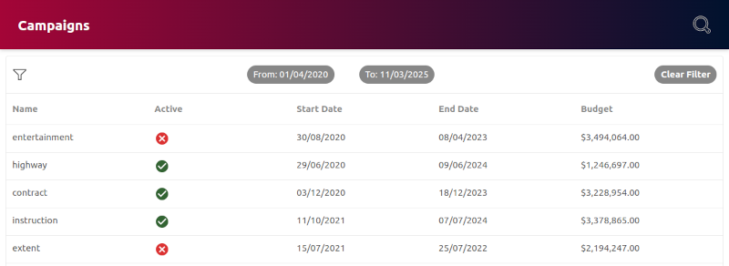

# King Makers

TODO
====

- is the typings folder required?
- is typings/custom/import-jpg.d.ts required
- are all the colors in tailwind config file required?



## Installation

Clone the app:
```
git clone git@github.com:salis010/king-makers.git
```
Install and build:
```
npm i && npm run build
```
Start
```
npm run server
```
Go to `localhost:3000` on a browser.

## Tech Stack
- React
- React-Router
- TypeScript
- Redux(toolkit)
- Tailwind
- Express
- Webpack

## Features


## Suggested Improvements

- the date picker needs some good improvements; ideally a more beautiful component than `<input type='date' />` is used.
- the app should cater for smaller screens too.
